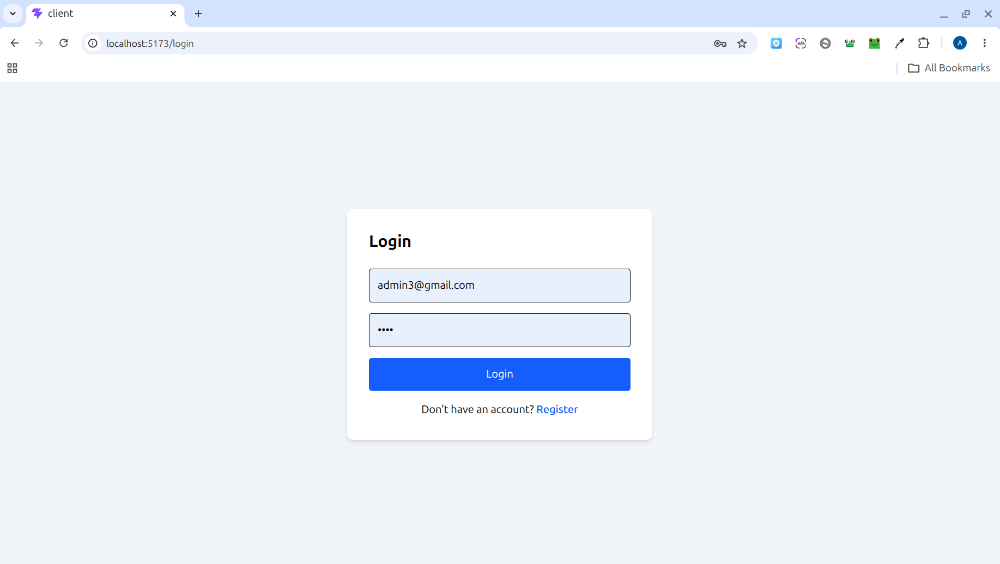
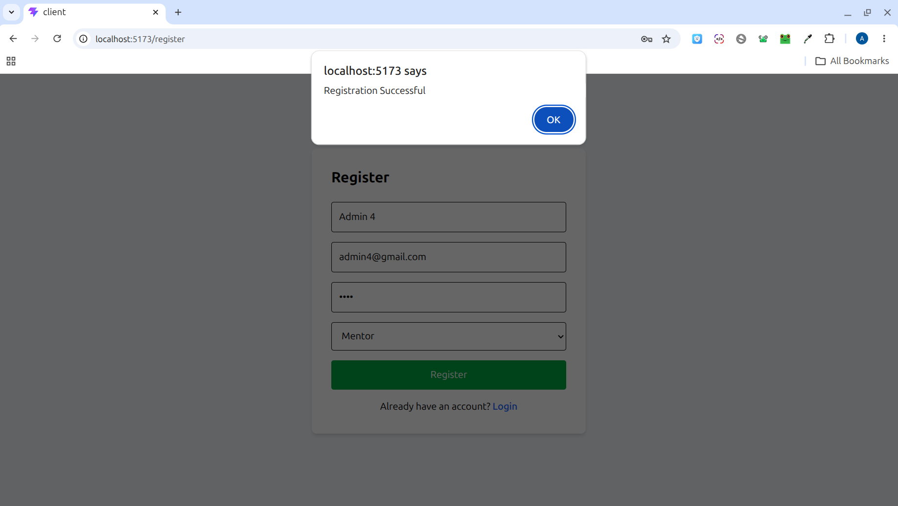
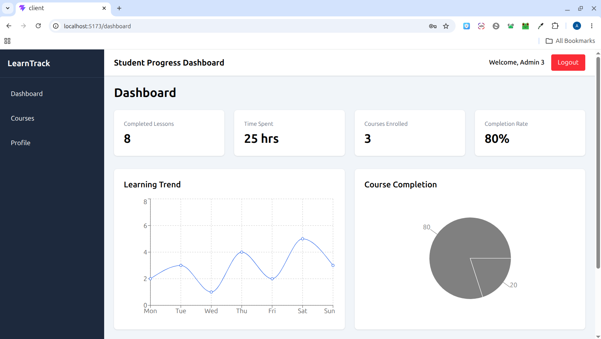
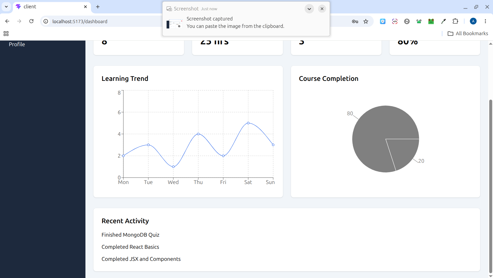
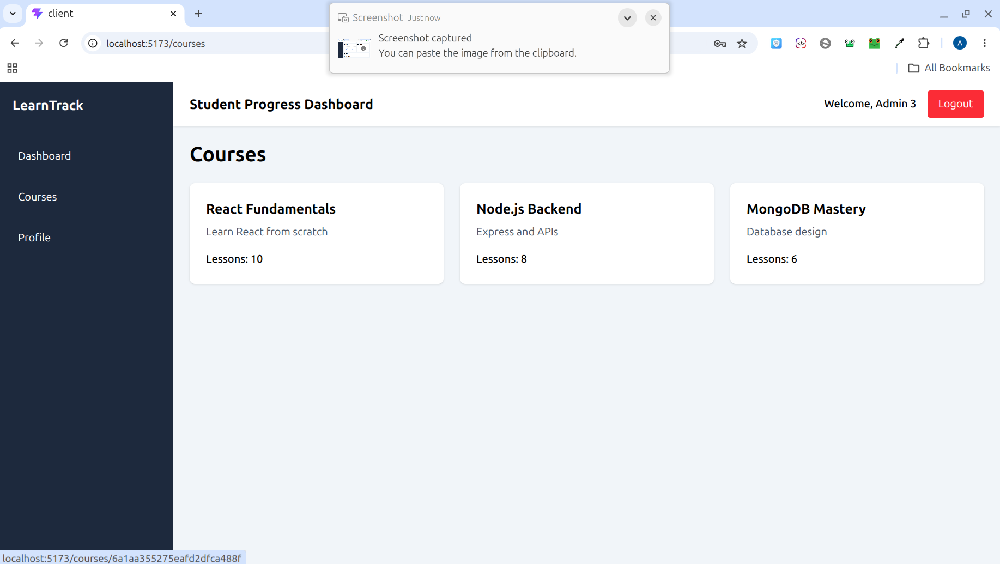
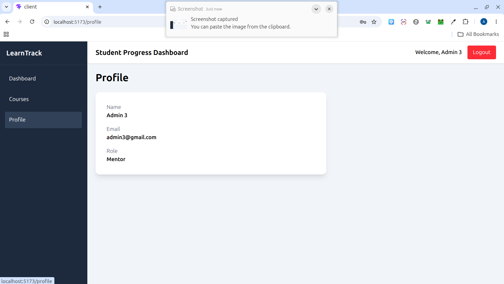

# 📊 Student Progress Dashboard (Full Stack MERN)

A full-stack web application that tracks student learning progress, course completion, and activity insights with visual analytics.

---

## 🚀 Features

### 👤 Authentication
- User Registration (Student / Mentor)
- User Login with JWT
- Protected Routes

### 📊 Dashboard
- Completed lessons tracking
- Time spent analytics
- Course progress overview
- Activity feed

### 📚 Courses
- List all courses
- Course details with lessons
- Progress tracking per course

### 📈 Visualizations
- Progress trend chart
- Completion pie/donut chart

### 🧑 Roles
- Student dashboard view
- Mentor-ready architecture (extensible)

---

## 🛠️ Tech Stack

### Frontend
- React
- React Router DOM
- Tailwind CSS
- Axios
- Recharts

### Backend
- Node.js
- Express.js
- MongoDB + Mongoose
- JWT Authentication
- bcryptjs

---

## 📁 Project Structure

```bash
student-progress-dashboard/
│
├── client/
│   ├── src/
│   ├── public/
│   └── package.json
│
├── server/
│   ├── controllers/
│   ├── routes/
│   ├── models/
│   ├── middleware/
│   └── server.js
│
├── screenshots/
│   ├── login.png
│   ├── register.png
│   ├── dashboard1.png
│   ├── dashboard2.png
│   ├── courses.png
│   └── profile.png
│
├── README.md
└── package.json
```

---

## 📸 Screenshots

### 🔐 Login Page


---

### 📝 Register Page


---

### 📊 Dashboard Overview


---

### 📈 Dashboard Analytics


---

### 📚 Courses Page


---

### 👤 Profile Page


---

## ⚙️ Installation & Setup

### 1️⃣ Clone Repository

```bash
git clone https://github.com/AnandAK07/student-progress-dashboard.git
```

---

### 2️⃣ Install Dependencies

#### Frontend

```bash
cd client
npm install
```

#### Backend

```bash
cd server
npm install
```

---

### 3️⃣ Configure Environment Variables

Create a `.env` file inside the `server` folder.

```env
MONGO_URI=your_mongodb_connection
JWT_SECRET=your_secret_key
PORT=5000
```

---

### 4️⃣ Run the Application

#### Start Backend

```bash
cd server
npm start
```

#### Start Frontend

```bash
cd client
npm start
```

---

## 🌟 Future Enhancements
- Mentor Dashboard
- Assignment Tracking
- Notifications
- Leaderboards
- Dark Mode

---

## 👨‍💻 Author

**Anand Kumar K**

- GitHub: https://github.com/AnandAK07

---

## 📄 License

This project is developed for educational and hackathon purposes.
